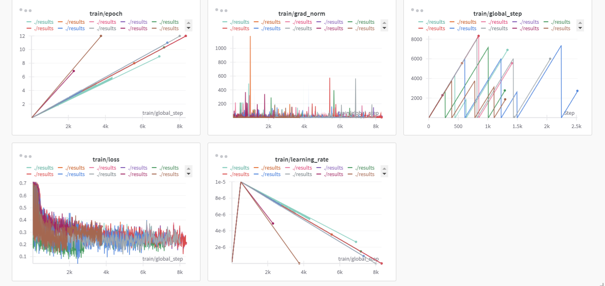
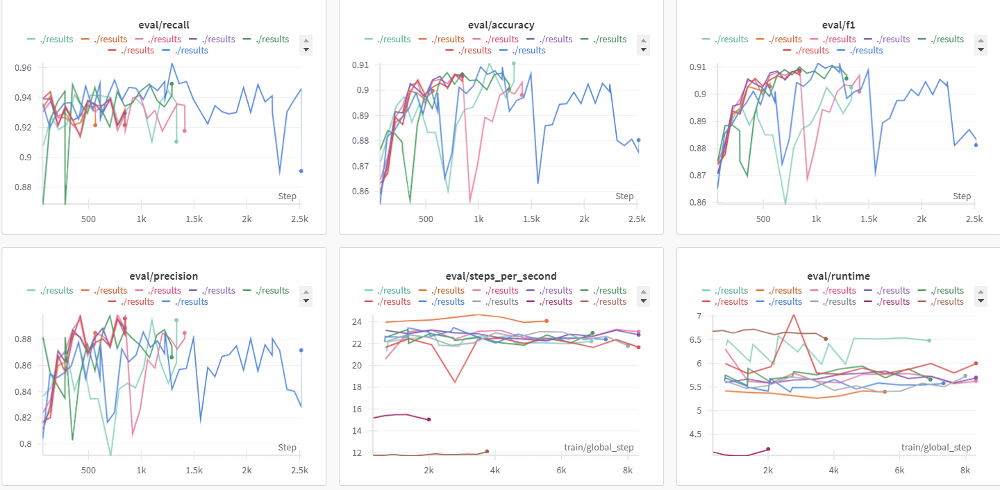

# Alert Text Detector 🚨📱
.png)
## Project Overview

Alert Text Detector is an advanced Natural Language Processing (NLP) model designed to identify and flag emergency or critical alert messages across social media platforms. Leveraging state-of-the-art machine learning techniques, this project aims to provide real-time detection of urgent communications.

## Key Features

- 🧠 **Advanced NLP Model**: Utilizes Bertweet Base model for sophisticated text classification
- 🔍 **High Precision Detection**: Achieves over 93% precision in identifying alert texts
- 📍 **Location-Based Alerts**: Customizable alert distribution based on user interests and locations
- 🔬 **Comprehensive Preprocessing**: Includes lemmatization, keyword extraction, and hashtag analysis

## Performance Metrics

### Validation Results
- **Accuracy**: 91.07%
- **Precision**: 89.46%
- **Recall**: 91.05%
- **F1 Score**: 90.25%

### Test Dataset Results
- **Accuracy**: 96.37%
- **Precision**: 93.17%
- **Recall**: 99.83%
- **F1 Score**: 96.39%

## Technology Stack

- **Machine Learning**: Hugging Face Transformers, Bertweet Base Model
- **Data Processing**: Pandas, NumPy, NLTK
- **Model Training**: PyTorch
- **Web Framework**: Flask
- **Database**: SQLite3

## Data Gathering
This project's core dataset was built from a combination of a ready-made source and a strategically designed synthetic dataset. The goal was to train a model that could handle the nuances of real-world language, including sarcasm, historical references, and diverse alert categories, which are often sources of misclassification.

The synthetic data was meticulously created across the following categories:

Handling Ambiguity & Sarcasm: Tweets with "negative" keywords that were not actual alerts (e.g., "What a disaster!" in a movie review or sarcastic remarks).

Temporal Context: Tweets mentioning past events that should not be flagged as current alerts (e.g., "The storm last year...").

Comprehensive Alert Categories: A wide range of positive alert tweets covering various scenarios, including:

Natural Disasters

Health Emergencies

Civil & Political Unrest

Infrastructure Failures & Accidents

Crime and Safety Alerts

Financial Emergencies

Varied Tweet Structures: Data was designed to mimic real social media posts, including tweets with and without hashtags, locations, and different points of view (e.g., first-person vs. third-person announcements).

This approach ensured the model was trained on a rich, diverse dataset that directly addressed common NLP challenges, leading to higher accuracy and precision. Following data collection, a comprehensive preprocessing pipeline was applied to clean and prepare the text for the model.


## Installation

1. Clone the repository
```bash
git clone https://github.com/saivasanthg/Alert_Text_Detector.git
cd Alert_Text_Detector

```


## Data Preprocessing Techniques

- Lemmatization
- Keyword extraction using `paraphrase-MiniLM-L6-v2`
- Hashtag analysis
- Train-test split (80% training, 20% validation)

## TRAINING PROCESS






## Future Roadmap

- [ ] Multi-language support
- [ ] Real-time streaming alert detection
- [ ] Integration with more social media platforms
- [ ] Decoding of emoticons for better contextual understanding


## License

Distributed under the MIT License. See `LICENSE` for more information.

## Contact

Sai Vasanth G
gsvsanth2004@gmail.com

