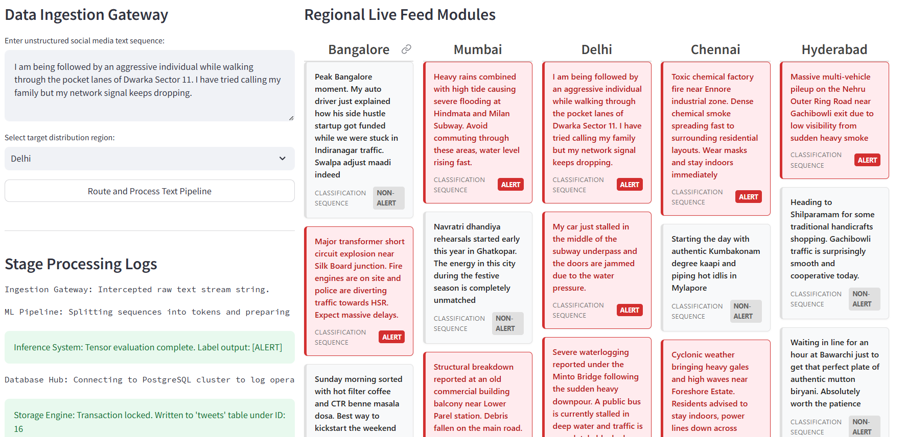
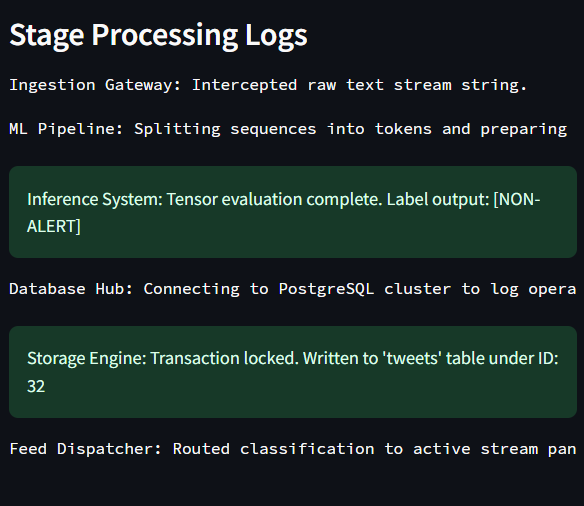
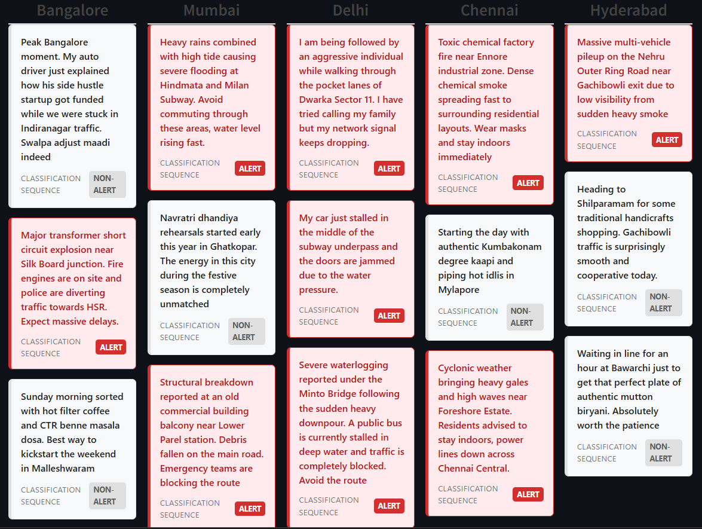
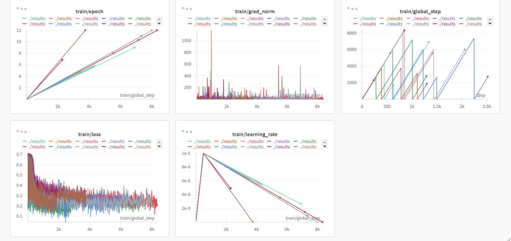
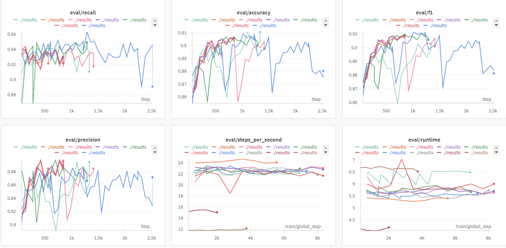

# SOCIAL MEDIA TEXT CLASSIFICATION ENGINE 
<p align="center">
  <!-- Top Left Image -->
  
  
  <!-- Top Right Image -->
  
  
  <br /> <!-- This forces the next image to the next line -->
  
  <!-- Bottom Centered Image -->
  
</p>


## Overview

Alert Text Detector is an advanced Natural Language Processing (NLP) model designed to identify and flag emergency or critical alert messages across social media platforms. Leveraging state-of-the-art machine learning techniques, this project aims to provide real-time detection of urgent communications.

## Key Features

-  **Advanced NLP Model**: Utilizes Bertweet Base model for sophisticated text classification
-  **High Precision Detection**: Achieves over 93% precision in identifying alert texts
-  **Location-Based Alerts**: Customizable alert distribution based on user interests and locations
-  **Comprehensive Preprocessing**: Includes lemmatization, keyword extraction, and hashtag analysis

## Performance Metrics

### Validation Results
- **Accuracy**: 91.07%
- **Precision**: 89.46%
- **Recall**: 91.05%
- **F1 Score**: 90.25%

### Test Dataset Results
- **Accuracy**: 96.37%
- **Precision**: 93.17%
- **Recall**: 99.83%
- **F1 Score**: 96.39%

## Technology Stack

- **Machine Learning**: Hugging Face Transformers, Bertweet Base Model
- **Data Processing**: Pandas, NumPy, NLTK
- **Model Training**: PyTorch
- **Web Framework**: Flask
- **Database**: PostGreSQL

## 📊 Dataset & Data Engineering Strategy

The core machine learning engine is trained on a hybrid data model combining established real-world benchmark datasets with a strategically designed, custom synthetic dataset. This approach ensures high precision across complex human linguistic nuances, eliminating common sources of false positives and adversarial misclassifications.

### Synthetic Data Engineering & Edge-Case Mitigation
To build robust semantic boundaries, synthetic data was programmatically injected across three critical categories:

1. **Handling Ambiguity & Sarcasm (Adversarial Data)**
   * Out-of-context phrases containing "negative" panic triggers that do *not* constitute active emergencies (e.g., *"What a complete disaster of a movie!"* or sarcastic conversational slang).
2. **Temporal Context Filtering**
   * Text sequences referencing past events to train the model to distinguish historical accounts from real-time crisis events (e.g., *"The heavy storm last year caused massive delays"*).
3. **Varied Text Structures**
   * Diverse post syntaxes including a mix of conversational sentences, first-person eyewitness accounts, third-person formal announcements, variable hashtag density, and scattered location markers.

---

### Operational Alert Classification Matrix
The dataset explicitly balances and maps out a wide baseline of emergency taxonomy across several operational vertices:

| Category | Targeted Threat Vector / Scenario Mapping |
| :--- | :--- |
| **Natural Disasters** | Floods, downpours, earthquakes, severe storms, waterlogging. |
| **Health Emergencies** | Outbreaks, critical medical casualties, emergency hospital routing. |
| **Civil & Political Unrest** | Protests, traffic blockades, public evacuations, demonstrations. |
| **Infrastructure Failures** | Underground gas line leakages, grid failures, broken utility lines. |
| **Crime & Safety Alerts** | Tracking, physical safety threats, stalking, immediate defense calls. |
| **Financial Emergencies** | Critical systemic alerts, high-impact market disruptions. |

### ⚙️ Text Preprocessing Pipeline
Following data aggregation, all items pass through a strict preprocessing sequence to clean noise while retaining semantic weight:
* **Token Standardization:** Normalizing colloquial syntax, mapping structural layout properties, and stripping erratic non-text sequences.
* **Feature Preservation:** Ensuring critical regional names, directional contexts, and threat markers remain intact before hitting the embedding layer.


## Installation

1. Clone the repository
```bash
git clone https://github.com/saivasanthg/Alert_Text_Detector.git
cd Alert_Text_Detector

```


## Data Preprocessing Techniques

- Lemmatization
- Keyword extraction using `paraphrase-MiniLM-L6-v2`
- Hashtag analysis
- Train-test split (80% training, 20% validation)

## TRAINING PROCESS





### Containerization & Architecture

The system is fully containerized using **Docker** and orchestrated via **Docker Compose**, establishing a scalable, multi-tenant microservice ecosystem. Instead of a monolithic layout, the pipeline is split into three decoupled services running over an isolated internal virtual network:

* **Frontend Service:** A lightweight containerized `Streamlit` dashboard providing live operational visibility and data entry gateways.
* **Backend Inference Engine:** A standalone `Flask` API container housing the fine-tuned deep learning transformer model, handling realtime text tokenization, inference execution, and pipeline routing.
* **Database Tier:** An isolated `PostgreSQL` relational container managing persistent transactional records and regional routing validation.

This containerized approach ensures complete environment configuration locking, zero host-machine dependency drift, and an immutable deployment setup that spins up instantly with a single command (`docker-compose up --build`).

## Future Roadmap

- [ ] Multi-language support
- [ ] Real-time streaming alert detection
- [ ] Integration with more social media platforms
- [ ] Decoding of emoticons for better contextual understanding


## License

Distributed under the MIT License. See `LICENSE` for more information.

## Contact

Sai Vasanth G
gsvsanth2004@gmail.com

